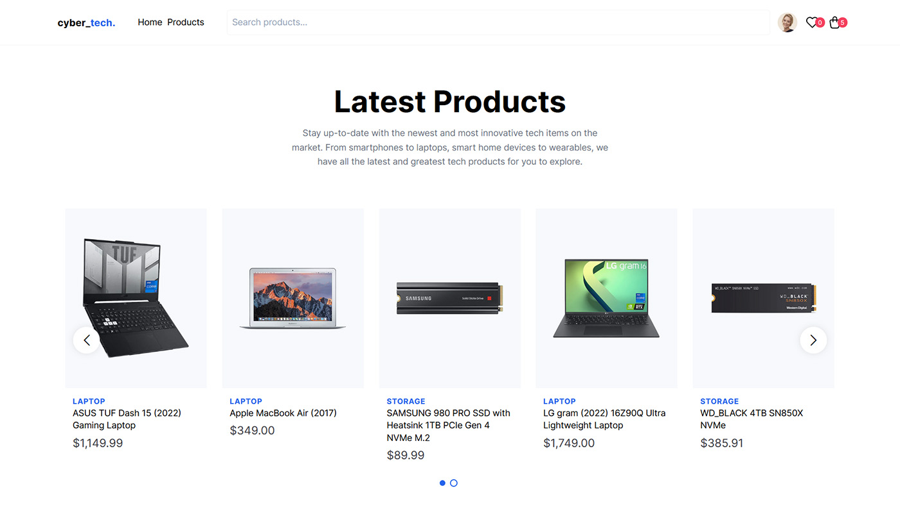

# CyberTech eCommerce
💫 Stay up-to-date with the newest and most innovative tech items on the market

<center>


</center>



## 📋 Description 

CyberTech eCommerce is build with Next 13, TailwindCSS and Stripe.

* Sort and filter products by name, price and price range
* Checkout products from your cart
* Shopping cart synchronized with Stripe API
* All products are managed in Stripe
* Responsive design

## 🔩 Tools
* React.js & Next.js
* Radix UI + shadcn/ui
* TailwindCSS
* Stripe
* SWR
* ESLint

## ✨ Test

* [Live demo](https://cybertech-ecommerce.vercel.app)

### Run app locally
```
git clone https://github.com/kypexfly/cybertech-ecommerce.git
cd cybertech-ecommerce
npm install
```
Add `.env` file to the root directory, following the `.env.example` file.
```
STRIPE_SECRET="your stripe secret"
```
Start the app
```
npm dev
```

## 🧪 Possible improvements / To Do
* Save cart in local storage
* Add debounce for price range filter
* Add pagination in products page
* Change dynamic route from id to slug
* When adding to cart, open dialog asking the quantity
* Add breadcrumbs
* Add landing page
    
##  🪄 Completed To Do
* Add skeletons
* Sort and filter elements
* Carousel (Latest products)
* Search by category
* Search bar + results
* Sync global state management with Stripe API (cart/modal component)
* Cart items counter should include quantity as well
* Add Github Workflow + Vercel deploy
* Transitions when opening  modal